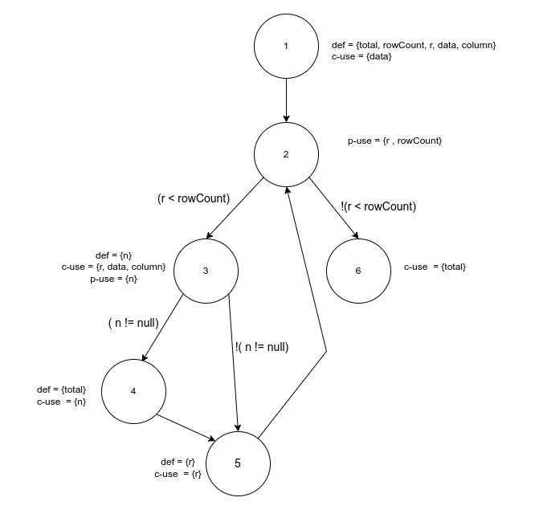
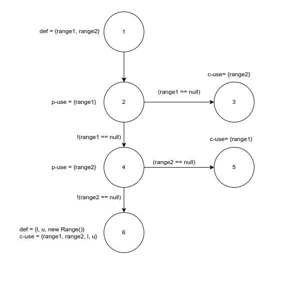
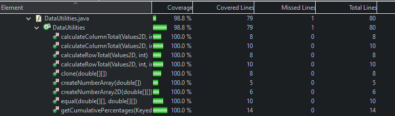
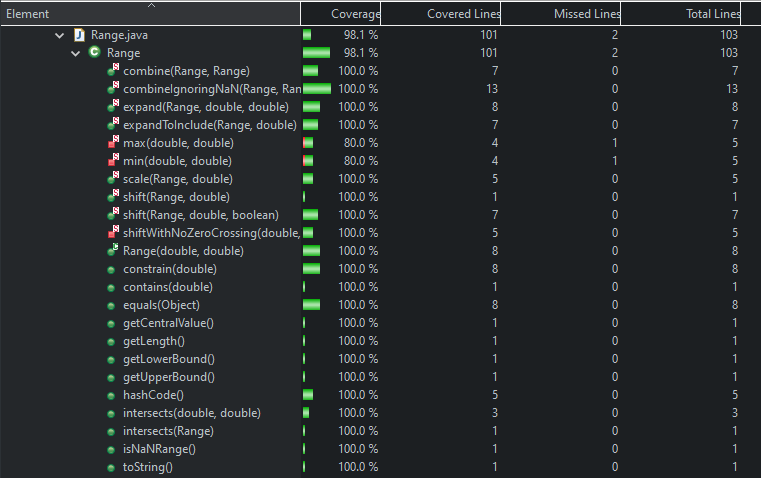

**SENG 438 - Software Testing, Reliability, and Quality**

**Lab. Report #3 – Code Coverage, Adequacy Criteria and Test Case Correlation**

| Group \#:      |  5  |
| -------------- | --- |
| Student Names: |  Nicholas Knapton   |
|                |  Jacob Artuso   |
|                |  Brian Kramer  |
|                |  Colin Christophe   |

# 1 Introduction

During our last lab we created tests for the Range and DataUtilities classes. This lab built on the last lab by requiring us to check coverage of these tests. With our new knowledge of how to cover more branches, conditions, and statement we created more tests to improve the code coverage. We were able to check our progress by using ECLEmma.  

# 2 Manual data-flow coverage calculations for X and Y methods
## DataUtilities.calculateColumnTotal()
### Data Flow Graph

### Def-Use Sets and DU-Pairs
Defs:
        
         def(1) = {total, rowCount, r, data, column}
         def(3) = {n}
         def(4) = {total}
         def(5) = {r} |
      
Uses:

         use(1) = {data} 
         use(2) = {r, rowCount}
         use(3) = {n, data, r, column}
         use(4) = {total , n}
         use(5) = {r}
         use(6) = {total}

DU-Pairs:

        for total  (1, 4) (4, 4) (4, 6) (1, 6) 
        for data (1, 1) (1, 3)
        for column (1, 3)
        for r (1, 2) (5, 5) (5, 2)
        for n (3, 3) (3, 4)
        for rowCount (1, 2)

    
### Testcases and DU-Pairs Covered

| Test Cases | DU-Pairs covered | DU-Pairs not covered |
| ---------- | ---------------- | -------------------- | 
| calculateColumnTotalTest | for total  (1, 4) (4, 4) (4,6) for r (1, 2) (5, 5) (5, 2) for n (3, 3) (3, 4) for rowCount (1, 2) for data (1, 1) (1, 3) for column (1, 3) | for total (1, 6) | 
| calculateColumnTotalTestZero | for total  (1, 4) (4, 4) (4,6) for r (1, 2) (5, 5) (5, 2) for n (3, 3) (3, 4) for rowCount (1, 2) for data (1, 1) (1, 3) for column (1, 3) | for total (1, 6) | 
| calculateColumnTotalTestNegative | for total  (1, 4) (4, 4) (4,6)for r (1, 2) (5, 5) (5, 2) for n (3, 3) (3, 4) for rowCount (1, 2) for data (1, 1) (1, 3) for column (1, 3) | for total (1, 6) | 
| calculateColumnTotalTestNoRows | for total (1, 6)  for r (1, 2) for data (1, 1) | for total  (1, 4) (4, 4) (4,6)  for r  (5, 5) (5, 2) for n (3, 3) (3, 4) for rowCount (1, 2) for column (1, 3) for data (1, 3) |
| calculateColumnTotalTestOtherColumn | for total  (1, 4) (4, 4) (4,6) for r (1, 2) (5, 5) (5, 2) for n (3, 3) (3, 4) for rowCount (1, 2) for data (1, 1) (1, 3) for column (1, 3) | for total (1, 6) |
| calculateColumnTotalTestZeroTotal | for total  (1, 4) (4, 4) (4,6) for r (1, 2) (5, 5) (5, 2) for n (3, 3) (3, 4) for rowCount (1, 2) for data (1, 1) (1, 3) for column (1, 3) | for total (1, 6) | 

### DU-Pair Coverage
`
Du-pair coverage = Du-pairs covered/Total du-pairs = 13/13 * 100% = 100%
`

## Range.combine()
### Data Flow Graph

### Def-Use Sets and DU-Pairs
Defs:
        
         def(1) = {range1,range2}
         def(6) = {l,u, new Range()}

      
Uses:

        use(2) = {range1} 
        use(3) = {range2}
        use(4) = {range2}
        use(5) = {range1}
        use(6) = {range1, range2, l , u, new Range()}

DU-Pairs:

        for range1 (1, 2) (1, 5) (1, 6)
        for range2 (1, 3) (1, 4) (1, 6)
        for l (6, 6)
        for u (6, 6)
        for new Range() (6, 6)

    
### Testcases and DU-Pairs Covered
Note the test cases below where done with parameterized testing so all the test cases below where the inputs as described by arg1, arg2, expected instead of a test name.

| Test Cases (arg 1, arg 2, expected) | DU-Pairs covered | DU-Pairs not covered |
| ---------- | ---------------- | -------------------- | 
| new Range(0,2), new Range(1,2), new Range(0,2) | for range1 (1, 2) (1, 6) for range2 (1, 4) (1, 6) for l (6, 6) for u (6, 6) for new Range() (6, 6) | for range1 (1, 5)  for range2 (1, 3) |
| new Range(1,2), new Range(0,2), new Range(0,2) | for range1 (1, 2) (1, 6) for range2 (1, 4) (1, 6) for l (6, 6) for u (6, 6) for new Range() (6, 6) | for range1 (1, 5)  for range2 (1, 3) |
| new Range(0,2), new Range(0,1), new Range(0,2) | for range1 (1, 2) (1, 6) for range2 (1, 4) (1, 6) for l (6, 6) for u (6, 6) for new Range() (6, 6) | for range1 (1, 5)  for range2 (1, 3) |
| new Range(0,1), new Range(0,2), new Range(0,2) | for range1 (1, 2) (1, 6) for range2 (1, 4) (1, 6) for l (6, 6) for u (6, 6) for new Range() (6, 6) | for range1 (1, 5)  for range2 (1, 3) |
| new Range(0,2), new Range(2,4), new Range(0,4) | for range1 (1, 2) (1, 6) for range2 (1, 4) (1, 6) for l (6, 6) for u (6, 6) for new Range() (6, 6) | for range1 (1, 5)  for range2 (1, 3) |
| new Range(0,1), new Range(3,4), new Range(0,4) | for range1 (1, 2) (1, 6) for range2 (1, 4) (1, 6) for l (6, 6) for u (6, 6) for new Range() (6, 6) | for range1 (1, 5)  for range2 (1, 3) |
| new Range(-1,0), new Range(0,1), new Range(-1,1) | for range1 (1, 2) (1, 6) for range2 (1, 4) (1, 6) for l (6, 6) for u (6, 6) for new Range() (6, 6) | for range1 (1, 5)  for range2 (1, 3) |
| new Range(0,1), new Range(0,1), new Range(0,1) | for range1 (1, 2) (1, 6) for range2 (1, 4) (1, 6) for l (6, 6) for u (6, 6) for new Range() (6, 6) | for range1 (1, 5)  for range2 (1, 3) | 
| new Range(0,1), null, new Range(0,1) | for range1 (1, 2) ( 1, 5) for range2 (1, 4) | for range1 (1, 6) for range2 (1,3) (1, 6) for l (6, 6) for u (6, 6) for new Range() (6, 6) |
| null, new Range(0,1), new Range(0,1) | for range1 (1, 2) for range2 (1, 3) | for range1 (1, 5) (1, 6) for range2 (1, 4) (1, 6) for l (6, 6) for u (6, 6) for new Range() (6, 6) | 
| null, null, null | for range1 (1, 2) for range2 (1, 3) | for range1 (1, 5) (1, 6) for range2 (1, 4) (1, 6) for l (6, 6) for u (6, 6) for new Range() (6, 6) |
| new Range(0,0), new Range(0,0), new Range(0,0) | for range1 (1, 2) (1, 6) for range2 (1, 4) (1, 6) for l (6, 6) for u (6, 6) for new Range() (6, 6) | for range1 (1, 5)  for range2 (1, 3) |
| new Range(0,50000), new Range(-50000,0), new Range(-50000,50000) | for range1 (1, 2) (1, 6) for range2 (1, 4) (1, 6) for l (6, 6) for u (6, 6) for new Range() (6, 6) | for range1 (1, 5)  for range2 (1, 3) |

### DU-Pair Coverage
`
Du-pair coverage = Du-pairs covered/Total du-pairs = 9/9 * 100% = 100%
`

# 3 A detailed description of the testing strategy for the new unit test

Our testing strategy was to look through the functions and create du-pairs for each function. We then use these pairs to check that our test cases would cover each of them adequately. Further, we then used white box testing methods to test the code coverage of our previously written tests and identify weak points. We will start with writting new tests for the larger functions in hopes that not only we will increase coverage for those specific tests but increase the coverage on functions they relied on as well, thus reducing the number of tests. We also decided to start with statement coverage when we write the new test cases. This is because we observed that by writting tests to increase statement coverage, we would likely greatly increase branch and condition coverage at the same time. However a similar strategy of writing tests to cover branches or conditions would also likely increase the coverage of the others at the same time aswell. Finally we will employ a strategy of writing test cases then running their coverage immediately. This will ensure that the tests we write actually cover their intended statement/branch/condition and dont just bloat our test suite. After writting all the new test cases we will peer review eachothers work. Since we worked in pairs to write these tests, we will review the othe groups work and they will review ours.

# 4 A high level description of five selected test cases you have designed using coverage information, and how they have increased code coverage

## In DataUtilities
- equalsTestNullFirst: ensured functionality was working in the equal method when the first inputted array in null. This increased both conditional and statement coverage.
- calculateColumnTotalTest: adding testing to the overloaded version of the calculateColumnTotal tests allow for the input of a valid row argument. This test increased statement coverage as we had not been testing this method before.
- calculateColumnTotalTestNull: ensured null value functionality working properly for the calculateColumnTotal overloaded method. This increased our condition coverage.

## In Range
- RangeIntersectsDoubleTest: Tested to ensure that the intersect function worked when given two doubles and a range. We used parameratized testing and selected inputs with expected values that we deemed would increase code coverage. We did this by examining the Range.intersects method and adding tests to cover all the branches, statements and conditions. This increased the conditional, statement, and branch coverage to high levels each as opposed to the previous 0% (this function was not tested in assignment 2 so was 0% initially).
-  RangeCombineIgnoringNaNTests: This tested the RangeCombineIgnoringNaN function which is a extension of the normal RangeCombine function. We used parameterized testing and selected inputs with expected values that we deemed would increase code coverage. We did this by firstly looking at the Range.combineIgnoringNaN and developing tests to cover all the statements, branhces, and conditions. This testing increased code coverage by increasing statement, branch, and conditional coverage that would not have been covered without the NaN version of the combine function.
# 5 A detailed report of the coverage achieved of each class and method (a screen shot from the code cover results in green and red color would suffice)

# 6 Pros and Cons of coverage tools used and Metrics you report

We decided to use eclemma, we found it very easy to integrate with eclipse and super easy to get set up and running. It was also very intuative to use and showed helpful results on the coverage including instruction, branch, line, method, type, and complexity coverage. Its easy to start and decent available features are a pro of eclemma. We did initially find it confusing as eclemma named some of the coverages different then what we had known them as though, however by looking at the notes we were able to discover that line and statement coverage are equivalent. Mocking was initially hard to get setup however we were able to get it working, this is a con because it took a bit but atleast it ended up working. We didnt experience any crashing of the program and didnt have any problems with integration of any other tools (other then mocking).

As for the metrics, statement coverage seemed to be a good place to start and by acheiving a high statement coverage alot of the other metrics also tend to increase which is definetly a pro of using statement coverage initially. Branch coverage was helpful to further ensure that all branches in the code where reached and explored. Finally condition coverage was also another helpful metric as it highlighted missed conditions that wouldnt be picked up in the statement or branch coverage metrics. 

# 7 A comparison on the advantages and disadvantages of requirements-based test generation and coverage-based test generation.

Requirements-based testing is easier to plan/carry out than coverage-based testing. This is because you only have to know what the expected output is and not how the function being tested operates. However, this does mean that requirements-based testing may not test the function completely. This is where it is advantageous to use coverage-based testing since you will ensure that every possibly test type is used. It may be usefull to deploy a combination of both coveraged based testing as well as requirements based as you get a little bit of both worlds. This is because you still can make sure real requirements are tested aswell as using coverage tools to ensure that the whole SUT is tested thoroughly.

# 8 A discussion on how the team work/effort was divided and managed

Team work was divided evenly at the start, we decided to employ pair programming to write the tests and measure coverage. The pairs were 1) Nick, Colin and 2) Jacob, Brain. We each chose a class to write the test cases on, pair 1 wrote tests for the Range class and pair 2 wrote tests for the DataUtilities class. Each pair then reviewed the other pairs work to check for quality and proper techniques. After the test suite was done, the report was divided between the two pairs then further divided within the group accordingly. 

# 9 Any difficulties encountered, challenges overcome, and lessons learned from performing the lab

We faced some challenges when it came to properly importing files from assignment 2 and downloading ECLEmma. However, utilizing slides and other online resources we were able to properly use these resources. By using ECLEmma we were able to learn some interesting insights about testing coverage and how we can ensure that our tests in the future properly cover the code. 

# 10 Comments/feedback on the lab itself

The lab was helpful for learning how to properly implement code coverage tools. It also taught how to use code coverage tools to improve current tests and create better tests for the future. We feel better prepared for testing our own code in the future and code we write while on the job.
