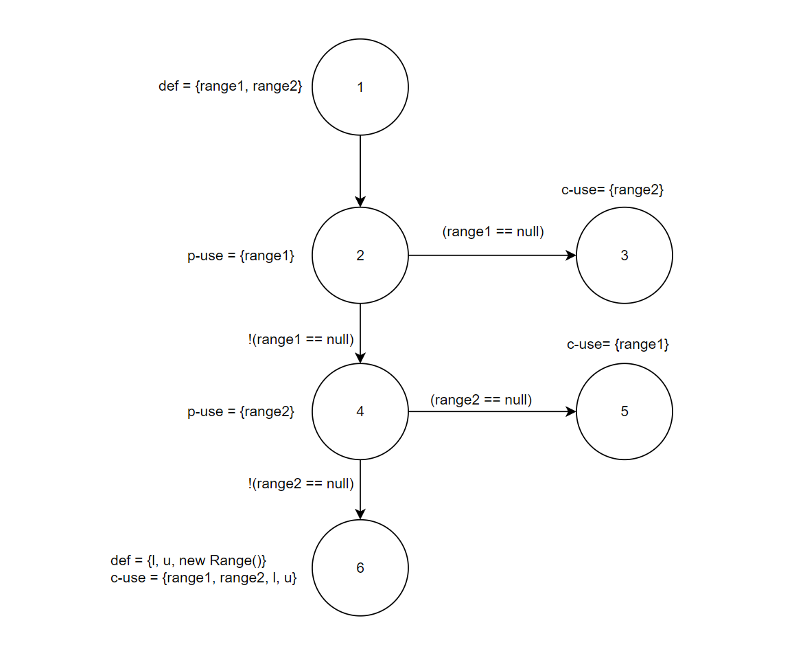

**SENG 438 - Software Testing, Reliability, and Quality**

**Lab. Report #3 – Code Coverage, Adequacy Criteria and Test Case Correlation**

| Group \#:      |  5  |
| -------------- | --- |
| Student Names: |  Nicholas Knapton   |
|                |  Jacob Artuso   |
|                |  Brian Kramer  |
|                |  Colin Christophe   |

# 1 Introduction

During our last lab we created tests for the Range and DataUtilities classes. This lab built on the last lab by requiring us to check coverage of these tests. With our new knowledge of how to cover more branches, conditions, and statement we created more tests to improve the code coverage. We were able to check our progress by using ECLEmma.  

# 2 Manual data-flow coverage calculations for X and Y methods

\
\
\
\
\
\
\

# 3 A detailed description of the testing strategy for the new unit test

Using DU pairs we were able to make sure all variables uses were tested. Further, we ensured that all branches were covered using white box testing. We expanded upon our previous tests as they were lacking in coverage. 

# 4 A high level description of five selected test cases you have designed using coverage information, and how they have increased code coverage

In DataUtilities...
- equalsTestNullFirst: ensured functionality was working in the equal method when the first inputted array in null. This increased both conditional and statement coverage.
- calculateColumnTotalTest: adding testing to the overloaded version of the calculateColumnTotal tests allow for the input of a valid row argument. This test increased statement coverage as we had not been testing this method before.
- calculateColumnTotalTestNull: ensured null value functionality working properly for the calculateColumnTotal overloaded method. This increased our condition coverage.
In Range...
- ADD HERE COLIN AND NICK
# 5 A detailed report of the coverage achieved of each class and method (a screen shot from the code cover results in green and red color would suffice)

\

# 6 Pros and Cons of coverage tools used and Metrics you report

We used eclemma, it was useful in terms of 

# 7 A comparison on the advantages and disadvantages of requirements-based test generation and coverage-based test generation.

Requirements-based testing is easier to plan/carry out than coverage-based testing. This is because you only have to know what the expected output is and not how the function being tested operates. However, this does mean that requirements-based testing may not test the function completely. This is where it is advantageous to use coverage-based testing since you will ensure that every possibly test type is used. 

# 8 A discussion on how the team work/effort was divided and managed

Team work was divided evenly in terms of writing the report, designing and writing the tests was done together on two computers for the sake of simplicity.

# 9 Any difficulties encountered, challenges overcome, and lessons learned from performing the lab

We faced some challenges when it came to properly importing files from assignment 2 and downloading ECLEmma. However, utilizing slides and other online resources we were able to properly use these resources. By using ECLEmma we were able to learn some interesting insights about testing coverage.

# 10 Comments/feedback on the lab itself

The lab was helpful for learning how to properly implement code coverage tools. It also taught how to use code coverage tools to improve current tests and create better tests for the future. 
